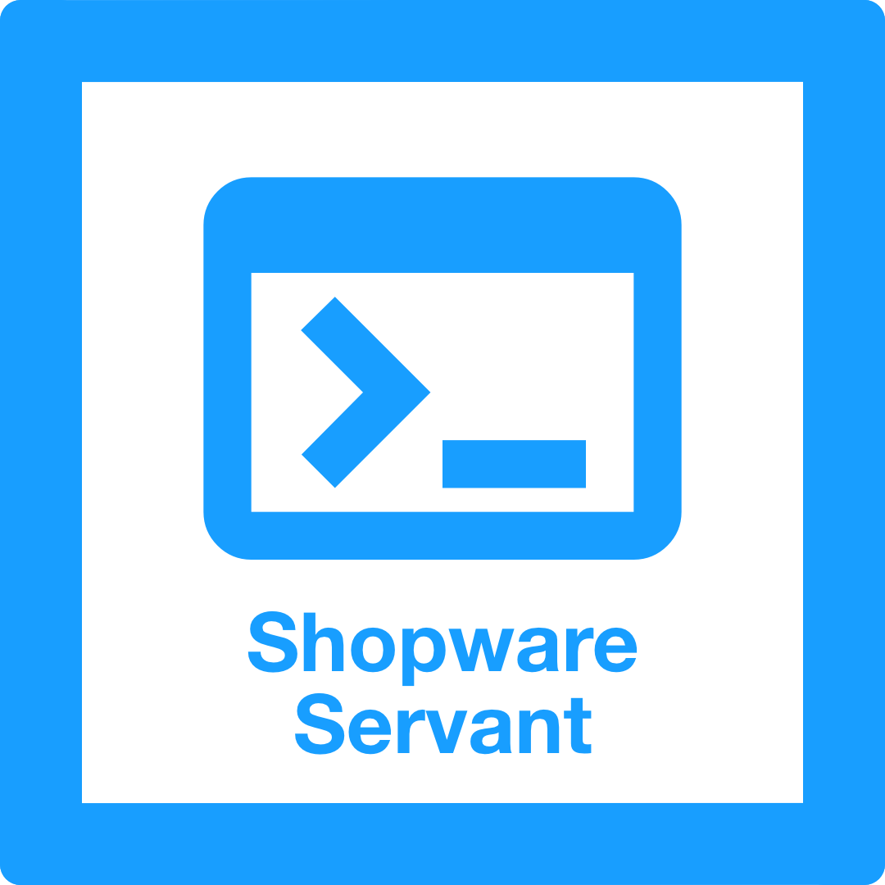

<p align="center">
    
</p>

<p align="center">
  <a href="https://github.com/Tschucki/shopware-servant/blob/main/LICENSE"></a>
</p>


<h4> <center>Shopware Plugin Servant </center></h4>

The Shopware Plugin Servant is a CLI tool to help you create and build Shopware 6 plugins. It is based on the Laravel Zero framework. With the Shopware Plugin Servant you can create a plugin much faster. Currently, it can create CMS-Elements and CMS-Blocks within your existing plugins. More features like adding new entities, services, controllers, and much more is under development.\
I created this tool to help me create plugins faster, as I found the process of creating plugins in Shopware 6 very time-consuming. I hope this tool can help you as well.

- Create Shopware 6 CMS-Elements automatically.
- Create Shopware 6 CMS-Blocks automatically
- Create Shopware 6 Entities automatically (in development)
- Create Shopware 6 Services automatically (in development)
- Create Shopware 6 Controllers automatically (in development)
- Create Shopware 6 Repositories automatically (in development)
- Create Shopware 6 Migrations automatically (in development)
- Create Shopware 6 Commands automatically (in development)

------

## Installation

You can install the Shopware Plugin Servant globally via Composer:

```bash
composer global require tschucki/shopware-servant
```

## Usage

After installing the Shopware Plugin Servant, you can use the `sw-servant` command to create a new plugin or add new CMS-Elements and CMS-Blocks to an existing plugin.

### Use Generator

```bash
sw-servant generate
```

This command will lead you through the process of adding new CMS-Elements and CMS-Blocks to an existing plugin.

## Updating

You can update the Shopware Plugin Servant via Composer:

```bash
composer global require tschucki/shopware-servant
```

## Documentation

Under development...

## License

Shopware Plugin Servant is an open-source software distributed under the AGPL-3.0 License. See [LICENSE](https://github.com/Tschucki/pr0p0ll/blob/main/LICENSE) for more
information.
